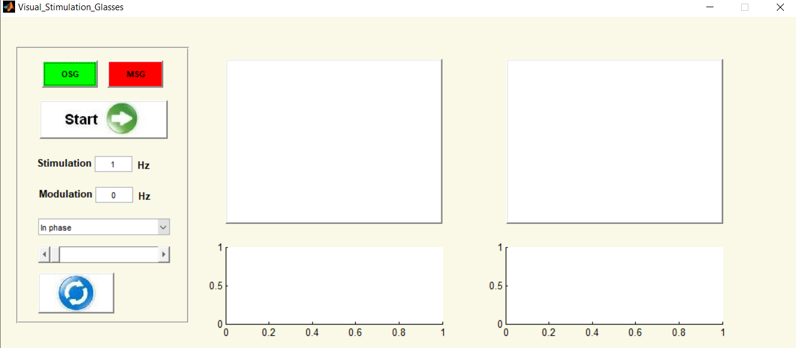
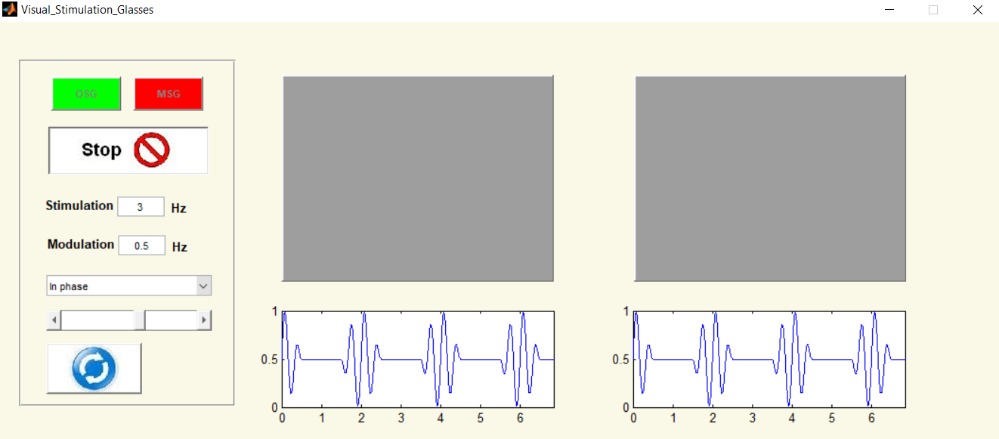
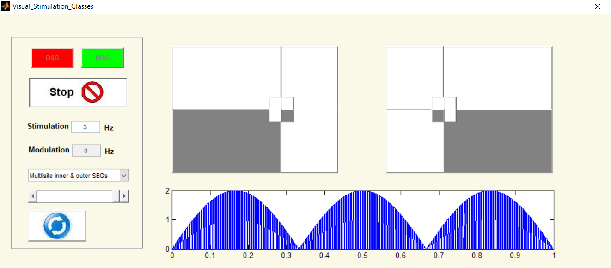

# Visual_Stimulation_Glasses_GUI
 

## Description:
The "Visual_Stimulation_Glasses" GUI is a MATLAB graphical user's interface that represents the functioning of One- and the Multi-Segment Glasses used for the visual stimulation of human and animal eyes for medical studies. The GUI simulates real glasses made of LCD material developed at the research center Jülich, at the institute of neuronscience and medicin (INM), Germany. It shows the different stimulation paradigms programmed for both glasses. 
 
 

 

## Single Segment Glasses (OSG)
 In the Single or (One)-Segment glasses (OSG) two stimulation patterns can be selected, which activate the stimulation glasses either in phase or out of phase. 
 The stimulation signal can be modulated by a cosine signal. 
  
  
 
 
 
 

## Multi Segment Glasses (MSG)
 By the Multi-segment glasses, seven stimulation patterns are programmed in which the segments of the glasses are activated in different forms. 
 The stimulation frequency of both glasses can be given in the input field labelled "Stimulation". 
  
  
 
 
 
 

# Usage
The Stimulation as well  as the modulation signal frequencies can be given in the input field labelled "Stimulation" and "Modulation", respectively. After pressing the "Start" button, the stimulation will be started. When changing the frequency of a signal or selecting another stimulation paradigm within one of the glasses, the stimulation can be restarted with the "refrech" button with no need for pressing the "Start" button again. 
