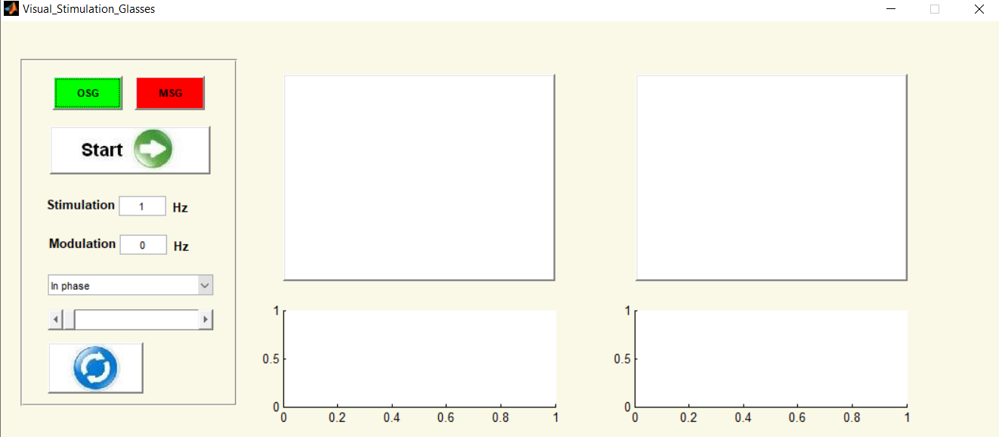
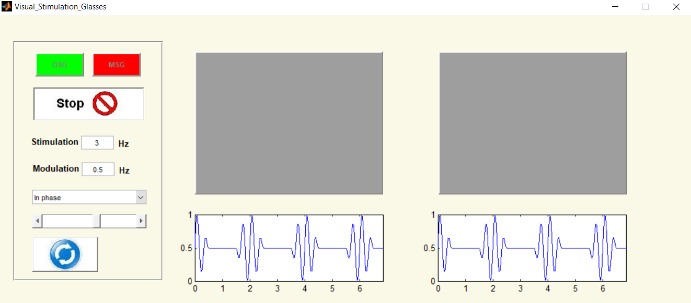
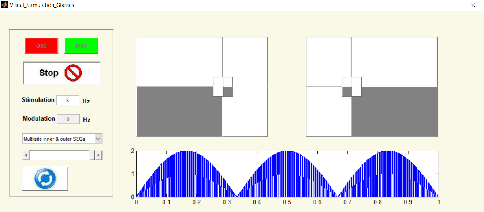

# Visual_Stimulation_Glasses_GUI
 

## Description:
The "Visual_Stimulation_Glasses" GUI is a MATLAB graphical user's interface that represents the functioning of One- and the Multi-Segment Glasses used for the visual stimulation. The GUI simulates real glasses made of LCD material. It shows the different stimulation paradigms programmed for both glasses. 
 
 

 

## Single Segment Glasses (OSG)
In the Single or (One)-Segment glasses (OSG) each glass consists of only one segment. Two stimulation patterns can be selected, which activate the stimulation glasses either in phase or out of phase. The stimulation signals can be modulated by a cosine signal and are displyed in the graphs. 
  
  
 
 
 
 

## Multi Segment Glasses (MSG)
Each glass of the Multi-segment glasses consists of eight segments, four small inner segments and four large outer segments. Seven stimulation patterns are programmed in which the segments of the glasses are activated in different forms. 
  
  
 
 
 
 

## Usage
The Stimulation as well as the modulation signal frequencies can be given in the input field labelled "Stimulation" and "Modulation", respectively. After pressing the "Start" button, the stimulation will be started. When changing the frequency of a signal or selecting another stimulation paradigm within one of the glasses, the stimulation can be restarted with the "refrech" button with no need for pressing the "Start" button again. 

## License
<The Motion_Analysis Toolbox >
    Copyright (C) <2008-2021>  <Dr. Safwan Al-Qadhi>

    This program is free software: you can redistribute it and/or modify
    it under the terms of the GNU General Public License as published by
    the Free Software Foundation version 3 of the License.

    This program is distributed in the hope that it will be useful,
    but WITHOUT ANY WARRANTY; without even the implied warranty of
    MERCHANTABILITY or FITNESS FOR A PARTICULAR PURPOSE.  See the
    GNU General Public License for more details.

    You should have received a copy of the GNU General Public License
    along with this program.  If not, see <https://www.gnu.org/licenses/>.

	Contact:	Dr. Safwan Al-Qadhi
			Email: saf.qadi@gmail.com, 
